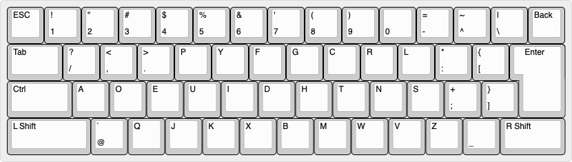
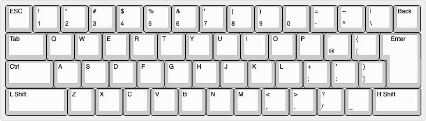

# SiON式Dvorak配列
SiON式Dvorak配列は、キー刻印はJIS配列のままでDvorak配列を使いやすくするため、以下の特徴を持たせてカスタマイズしたキー配列です。  

## 主な特徴
- 記号の配置は、なるべくJIS配列に準拠
- `L Shift`以外の修飾キー押下時は、QWERTYとして動作

# キー配列
## 直接入力, `L Shift`押下時  
  
Dvorak配列として動作します。本家Dvorak配列と比較して、以下の違いがあります。  

- 1段目がJIS配列に完全準拠しています  
- `[`, `]`, `_`キーは、JIS配列通りに配置しています  
- 3段目の英字キーの右端に`;`を配置した都合上、`:`キーを上に逃がしています  
- 残った2つの`/`, `@`キーは、それぞれ2段目と4段目の左端に配置しています  

## `L Shift`以外の修飾キー押下時  
  
